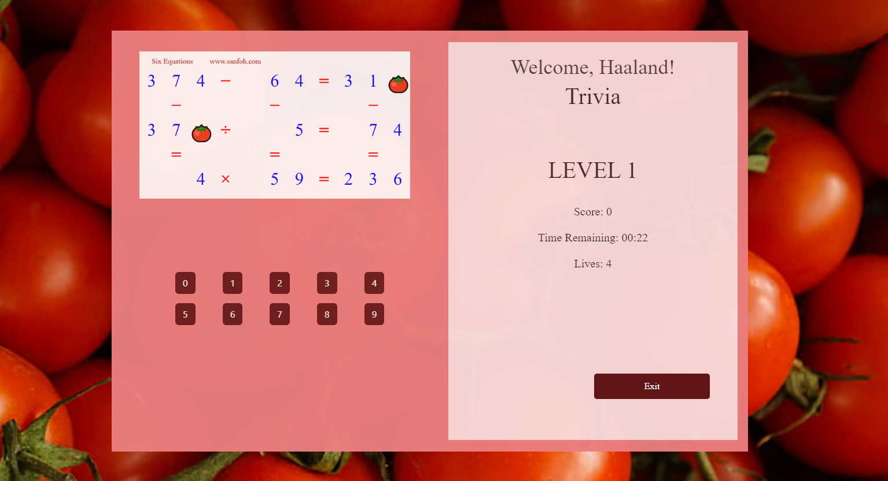

<<<<<<< HEAD

# Trivia

Welcome to Trivia, an exciting quiz game designed for the final year project! This project utilizes the Tomato API to create an immersive gaming experience while exploring various concepts, paradigms, and architectures related to Software Development


## Key Themes

- Software Design Principles
- Event-Driven Programming
- Interoperability
- Virtual Identity
## Game Features

- 6 Levels: Progress through six challenging levels.
- 5 Questions per Level: Each level presents five unique trivia questions.
- Scoring: Each correct answer earns 10 points. Achieve a perfect score of 250 points to win the game.
- Leaderboard: Players can view and compare their high scores with others.
- Tomato API Integration: Uses the Tomato API to dynamically fetch trivia questions.

## Tech Stack

**Frontend:** HTML, CSS, Bootstrap, JavaScript, jQuery

**Backend:** PHP, MySQL (via XAMPP)

**APIs:** Tomato API for retrieving trivia questions


## Installation

To run this project locally, follow the steps below:

**Clone the Repository:**

```bash
git clone git@github.com:Hassaaniqbal/trivia.git

```

**Setup XAMPP:**
- Download and install XAMPP to set up a local PHP server.
- Place the cloned project folder in the XAMPP htdocs directory.


**Create the Database:**

- Open phpMyAdmin through the XAMPP control panel.
- Create a new database and import the game.sql file located in the dataa directory.


**Configure the Project:**

- Ensure the database.php file in dataa directory contains the correct database connection details.


**Run the Application:**

- Start Apache and MySQL services from the XAMPP control panel.
- Access the game by navigating to [http://localhost/<project-directory>/trivia.php](http://localhost/<project-directory>/trivia.php) in your browser.


## Screenshots




## Contributing

Contributions are always welcome!

See [contributing.md](./contributing.md) for ways to get started.

Please adhere to this project's [code of conduct](./CODE_OF_CONDUCT.md).


## License


This project is licensed under the MIT License. See the [LICENSE](./LICENSE.txt) file for details.
